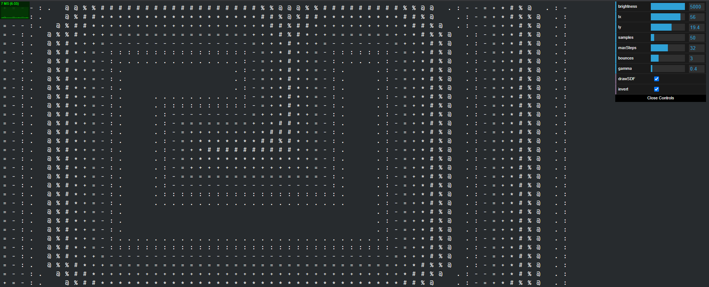

# ascii-photons-js

Demo: https://ddupont808.github.io/ascii-photons-js/

Pathtracer written in js and rendered using ASCII characters. Uses gpu.js for acceleration. 

Currently the photons don't bounce due to what's probably a bug in my raymarching function, but I managed to hide most of the fact that it's broken by implementing direct light sampling.

Code is a port of my Unity2D Pathtracer, check it out if you want to see what this is supposed to look like: https://github.com/ddupont808/Unity2D-Pathtracer

Probably not gonna finish it cuz of gpu.js limitations preventing me from organizing my shader code better, but expect a canvas-photons-js coming soon using WebGPU

# Showcase 

## SDF viewer

